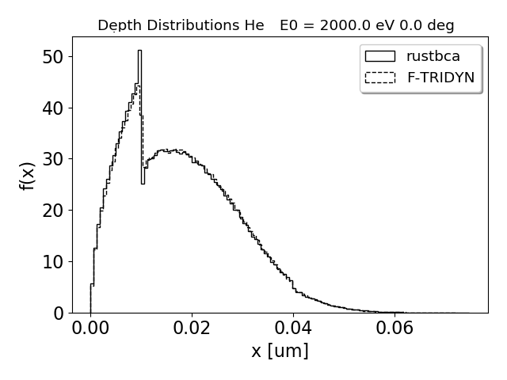
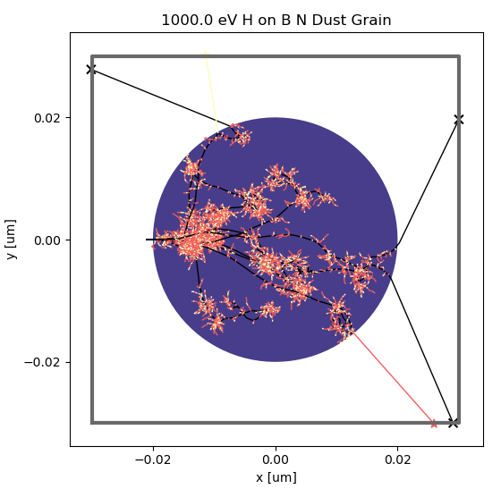

# Summary

Ion-material interactions are of vital importance in industrial applications, the study and design of nuclear fusion devices, the engineering of survivable spacecraft components, and more. In particular, plasma-material interactions are typically dominated by ion-material interactions, including the phenomena of sputtering, reflection, and implantation. These phenomena are difficult to model analytically, and many such models rely on empirical or semi-empirical formulas, such as the Yamamura sputtering yield formula [@Yamamura1982], or the Thomas reflection coefficient [@Thomas1992]. However, such models are inherently limited, and of little applicability to complex geometry, multi-component surfaces, or for coupling to plasma or material dynamics codes. Since ion-material interactions span a range of energies from sub-eV to GeV and beyond, n-body approaches such as molecular dynamics can be computationally infeasible for many applications where the characteristic ion range exceeds the limits of reasonable molecular dynamics domains. Instead, approximations to the full n-body problem are used; the most common of these is the Binary Collision Approximation (BCA), a set of simplifying assumptions to the full n-body problem. RustBCA is a high-performance, general purpose, ion-material interactions BCA code, built for scientific flexibility and ease of use. RustBCA includes electronic stopping formulations for low energy (up to 25 keV/nucleon) and high energy (up to 1 GeV/nucleon), Kr-C, ZBL, Moliere, and Lenz-Jensen screened coulomb interatomic potentials, Lennard-Jones and Morse attractive-repulsive potentials, the unique capability of using multiple interatomic potentials in a single simulation, choice of Gaussian quadrature and the approximate MAGIC algorithm for determining scattering angles, full trajectory tracking of ions and material atoms, including local nuclear and electronic energy losses, a human- and machine-readable configuration file, and full 6D output of all particles that leave the simulation (via sputtering or reflection). Additionally, RustBCA includes multiple geometry types, including 0D (infinite, homogeneous target), 1D (finite depth, layered target), 2D (triangular mesh based target) and 3D (spherical geometry), with the ability to easily extend to further geometry types using Rust's type generics and trait systems.

# Binary Collision Approximation Codes

RustBCA is an amorphous-material BCA code, following the TRIM [@Biersack1980] family of codes, which includes Tridyn [@Möller1988], SDTrimSP [@Mutzke2019], F-TRIDYN [@Drobny2017], and SRIM [@Ziegler2010]; this has historically been the most popular implementation of the BCA. Based on the number of citations recorded in Google Scholar at the time of writing, SRIM is the most popular amorphous-material BCA code, likely due to its being free to download, available on Windows, and having a graphical user interface. It is followed by the original TRIM code, upon which SRIM was based, then Tridyn, and finally SDTrimSP. Crystalline-material BCA codes have also been developed, such as MARLOWE [@Robinson1974], OKSANA [@Shulga1984],  and some versions of ACAT [@Yamamura1996], but are not as widely used. The BCA itself is a set of simplifying assumptions for the ion-material interaction problem; the assumptions used in the amorphous-material BCA can be summarized as follows:

* Particles in the code, ions and material atoms both, are "superparticles" that represent many real ions or atoms each
* Energetic particles interact with initially stationary atoms in the material through elastic, binary collisions
* Collisions occur at mean-free-path lengths, or exponentially distributed path lengths for gaseous targets
* Particle trajectories are approximated by the classical asymptotic trajectories
* Electronic interactions are separated from the nuclear, elastic interactions
* Local electronic energy losses occur at each collision
* Nonlocal electronic energy losses occur along each segment of the asymptotic trajectories
* Material atoms are mobile and transfer momentum following collisions
* Particles are stopped when their energy drops below a threshold, cutoff energy, or when they leave the simulation as sputtered or reflected/transmitted particles
* Particles that leave a surface experience reflection by or refraction through a locally planar surface binding potential
* When simulating radiation damage, only material atoms given an energy larger than the threshold displacement energy will be considered removed from their original location

For detailed summaries of the history and theory of binary collision approximation codes, see the review by Robinson [@Robinson1994] and the text by Eckstein [@Eckstein1991].

# Statement of Need

Ion-material interactions have been historically modeled using analytical and semi-empirical formulas, such as Sigmund's sputtering theory [@Sigmund1987], the Bohdansky formula [@Bohdansky1980; @Bohdansky1984], the Yamamura formula [@Yamamura1982; @Yamamura1983; @Yamamura1984], and the Thomas et al. reflection coefficient [@Thomas1992]. However, for any physical situation beyond the regimes of validity of these formulas (e.g., non-normal angles of incidence), or for complex geometry, or for inhomogeneous composition, straightforward empirical formulas cannot be reliably used. Many BCA codes have been developed to provide computationally efficient solutions to these problems, including SRIM [@Ziegler2010], Tridyn [@Möller1988], F-TRIDYN [@Drobny2017], SDTrimSP [@Mutzke2019] and its derivatives, which are based on the original TRIM [@Biersack1980] code. However, each has limitations that prevent widespread adoption across a broad range of applications. In particular, SRIM, which is free-use but closed-source, suffers from relatively poor computational performance and significant anomalies in sputtered atom angular distributions and light ion sputtering yields [@Shulga2019; @Shulga2018; @Hofsass2014; @Wittmaack2004]. Tridyn and F-TRIDYN, which are not open source, are limited to low ion energy, specific screened-coulomb potentials, mono-angular ion beams, atomically flat and atomically rough surfaces respectively, and are single-threaded. SDTrimSP, although significantly more advanced than the preceding codes, is built on the original TRIM source code and is not open-source.

As far as the authors are aware, there is no widely-used open-source BCA code suitable for simulating plasma-material interactions. Iradina is an open source BCA that has been used for ion-material interactions in a semicondcutor context [@HollandMoritz2017; @Johannes2014], but sputtering yields from iradina have not been shown to agree with direct comparisons to other BCA codes for a wide range of ions, targets, energies, or angles, and reflection coefficients or other key quantities of interest have not yet, to our knowledge, been reported. Additionally, those BCA codes that are available, through licensing agreements or as closed-source software, are not well suited to a wide range of physical problems. Particularly, the direct integration of BCA codes to particle or subsurface dynamics codes, such as those performed using F-TRIDYN for ITER divertor simulations [@Lasa2020], requires costly external wrappers to manage simulations and process output files to perform file-based coupling. RustBCA, as part of the Plasma Surface Interactions 2 SciDAC Project suite of codes, has been developed to fill that gap and expand upon the feature set included in currently available BCA codes. Features unique to RustBCA include the ability to handle attractive-repulsive interatomic potentials, use multiple interatomic potentials in one simulation, handle high-energy incident ions and multiple geometry types, use large file input of incident particles to facilitate coupling to other codes via HDF5, output pre-binned distributions without post-processing of text-based particle lists, and use a human- and machine-readable configuration file. RustBCA has been designed with modern programming techniques, robust error-handling, and multi-threading capability. RustBCA is being developed as both a standalone code and as a library code that may be used to add BCA routines to other high-performance codes to avoid file-based code coupling entirely. Additionally, the TRIM family of codes typically relies on the MAGIC algorithm to approximate the scattering integral with 5 fitting coefficients. RustBCA includes not only an implementation of the MAGIC algorithm, but also Mendenhall-Weller, Gauss-Mehler, and Gauss-Legendre quadrature, the three of which are significantly more accurate than the MAGIC algorithm. We hope that giving users direct access to a user-friendly, flexible, high-performance, open-source BCA will encourage and enable heretofore unexplored research in ion-materials interactions.

![Figure showing sputtering yields of silicon from SRIM, RustBCA, F-TRIDYN, Yamamura's formula for Q=0.33-0.99, and a smooth analytical fit to experimental data by Wittmaack [@Wittmaack2004], for an incident energy of 1 keV and for many different projectiles.](corrected_yields.png)

Quantities of interest from RustBCA, including sputtering yields, have been benchmarked against F-TRIDYN, SRIM, empirical formulas, and experiments. This summary figure shows the sputtering yields of silicon by 1 keV helium, beryllium, oxygen, neon, aluminum, silicon, argon, titanium, copper, krypton, xenon, ytterbium, tungsten, gold, lead and uranium ions. SRIM's unphysical Z1 dependence is clearly visible, as is the divergence of Yamamura's formula (for Q = 0.66, the reported value for silicon, and +/- 0.33) at high mass ratios (M1 >> M2) from the experimental data collected by Wittmaack [@Wittmaack2004]. RustBCA and F-TRIDYN both reproduce the correct Z1 dependence of the sputtering yield, and correctly model the magnitude of the yield for all projectiles. It should be noted that, for this simulation, F-TRIDYN uses corrected MAGIC coefficients, reported in [@Ziegler2010], that differ from those originally included in the Tridyn source code; Tridyn's orignal MAGIC coefficients underestimated the sputtering yield for high mass ratios. A soft grey line depicts the point of silicon on silicon sputtering. Reflection coefficients, although very low for mass ratios above one, are also shown, with F-TRIDYN and RustBCA agreeing with the semi-empirical Thomas reflection coefficient formula.

# Examples

RustBCA includes multiple example input files, under the examples/ folder on the directory, as well as discussion of each on the RustBCA github wiki page. Three examples will be summarized here.

First, an example of 2 keV helium ions at normal incidence on a layered titanium dioxide, aluminum, and silicon target can be run in 2D with:

 `cargo run --release examples/layered_target.toml`
 
 The same example using the 1D layered geometry can be run with:
 
  `cargo run --release 1D examples/layered_target_1D.toml`

 

 The depth distribution, compared to F-TRIDYN, clearly shows the effect of layer composition and sharp interfaces on the combined nuclear and electronic stopping of helium.

 Second, as an example of the capability of RustBCA to handle 2D geometry, the trajectories of 1 keV hydrogen on a circular cross-section of boron-nitride can be simulated.

 `cargo run --release examples/boron_nitride.toml`

 

Third, the 2D boron nitride example can be run as a spherical boron nitride dust grain, by running the following command:

`cargo run --release SPHERE examples/boron_nitride_sphere.toml`

The trajectories can be plotted in 3D with mayavi using `do_trajectory_plot_3d()` or in 2D with matplotlib using `do_trajectory_plot()` in `scripts/rustbca.py`.

# Acknowledgements
This work was funded by the U.S. Department of Energy, Office of Fusion Energy Sciences through the Scientific Discovery through Advanced Computing (SciDAC) project on Plasma Surface Interactions 2 (Grant No. DE-SC0018141).

# References
